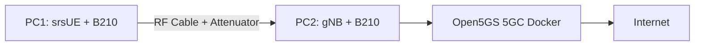

# 📡 5G-INSTALLATION — srsRAN 5G SA + Open5GS + GPSDO


---

## 🧠 Architecture



---

## ⚙️ Prérequis (PC1 & PC2)

### 🔧 CPU en mode performance

```bash
for i in /sys/devices/system/cpu/cpu*/cpufreq/scaling_governor; do
    echo performance | sudo tee $i
done

cat /sys/devices/system/cpu/cpu0/cpufreq/scaling_governor
```

---

# 🛰️ GPSDO + UHD (PC2)

## 📷 Hardware (OCXO / GPSDO)

<p align="center">
  
  
  
</p>

---

## 🐳 (Optionnel) Environnement Docker UHD

```bash
xhost +
docker image pull ubuntu:24.04

docker run -tid --privileged \
-v /dev/bus/usb:/dev/bus/usb \
-v /tmp/.X11-unix:/tmp/.X11-unix:ro \
-v $XAUTHORITY:/home/user/.Xauthority:ro \
--net=host \
--env="DISPLAY=$DISPLAY" \
--env="LC_ALL=C.UTF-8" \
--env="LANG=C.UTF-8" \
--name gpsdo_03_2026 ubuntu:24.04

docker exec -ti gpsdo_03_2026 /bin/bash
```

---

## 📦 Installation UHD + dépendances

```bash
apt update

apt install -y git cmake build-essential \
libboost-all-dev libusb-1.0-0-dev python3-dev \
python3-mako python3-numpy python3-requests \
python3-setuptools libfftw3-dev libcomedi-dev \
libgps-dev libgmp-dev swig pkg-config gedit
```

---

## 🔧 Compilation UHD (avec patch GPS)

```bash
git clone https://github.com/EttusResearch/uhd.git
cd uhd
```

### ✏️ Patch GPSDO

```bash
gedit host/lib/usrp/gps_ctrl.cpp
```

### ✅ Modification 1

```cpp
static const std::regex gp_msg_regex("^\\$G.*$");
```

➡️ devient :

```cpp
static const std::regex gp_msg_regex("^\\$GP.*,\\*[0-9A-F]{2}$");
```

---

### ✅ Modification 2

```cpp
msgs[msg.substr(1, 5)] = msg;
```

➡️ ajouter avant :

```cpp
if(msg.substr(1,2) == "GN"){ msg.replace(1, 2, "GP");}
```

---

## 🏗️ Build UHD

```bash
cd host
mkdir build && cd build

cmake .. -DENABLE_PYTHON=ON -DENABLE_LIBUHD=ON -DPYTHON_EXECUTABLE=$(which python3)

make -j$(nproc)
sudo make install
sudo ldconfig
```

---

## 📡 Télécharger images USRP

```bash
cd /usr/local/lib/uhd/utils/
sudo ./uhd_images_downloader
```

---

## 🛰️ Test GPSDO

```bash
./query_gpsdo_sensors
```

✔️ Vérifier :

* `gps_locked = true`
* `ref_locked = true`

---

## 🐍 Script Python GPSDO (test avancé)

```bash
nano test_usrp_gpsdo.py
```

```bash
python3 test_usrp_gpsdo.py
```

✔️ Vérifier :

* GPS LOCK
* PPS sync
* temps aligné

---

# 🐳 Docker Open5GS (PC2)

```bash
sudo apt-get install -y docker.io docker-compose-plugin
sudo usermod -aG docker $USER
newgrp docker
```

---

# 🏗️ Installation srsRAN gNB

```bash
git clone https://github.com/srsran/srsRAN_Project.git
cd srsRAN_Project

mkdir build && cd build

cmake .. -DENABLE_UHD=ON
make -j$(nproc) gnb
```

---

# 📡 Installation srsUE (PC1)

```bash
git clone https://github.com/srsran/srsRAN_4G.git
cd srsRAN_4G

mkdir build && cd build
cmake ..
make -j$(nproc) srsue
```

---

# 🌐 Configuration Open5GS

## 🔎 IP PC2

```bash
ip addr show | grep "inet " | grep -v "127\|10.45\|172"
```

---

## ⚙️ open5gs.env

```bash
nano ~/srsRAN_Project/docker/open5gs/open5gs.env
```

---

## 🚀 Démarrage 5G Core

```bash
cd ~/srsRAN_Project/docker
docker compose up -d 5gc
```

---

# 📶 Configuration gNB

```bash
nano ~/gnb_uhd.yaml
```

⚠️ IMPORTANT :

```yaml
device_args: type=b200,clock=gpsdo
```

---

# 📱 Configuration UE

```bash
nano ~/ue_uhd.conf
```

---

# ▶️ Démarrage

## PC2

```bash
sudo ~/start_5g.sh

cd ~/srsRAN_Project/build/apps/gnb
sudo ./gnb -c ~/gnb_uhd.yaml
```

---

## PC1

```bash
sudo ./srsue ~/ue_uhd.conf
```

---

# 🔍 Vérifications

```bash
docker logs open5gs_5gc | grep PFCP
sudo ss -ulnp | grep 2152
docker logs open5gs_5gc | grep gNB
```

---

# ⚠️ Troubleshooting

| Problème       | Solution         |
| -------------- | ---------------- |
| GPS non lock   | vérifier antenne |
| pas de sync    | vérifier PPS     |
| UE attach fail | vérifier IP      |
| packet loss    | vérifier NAT     |

---

# ✅ Résultat attendu

* UE attaché ✅
* Synchronisation GPSDO OK ✅
* PDU Session OK ✅
* Ping Internet OK ✅

---

# 🧠 Tips avancés

* Toujours vérifier **GPS ALIGN**
* Utiliser `taskset` pour éviter les underflows
* Éviter WiFi → utiliser Ethernet

---

# 🔥 Auteur

**5G Lab / SDR Research**
